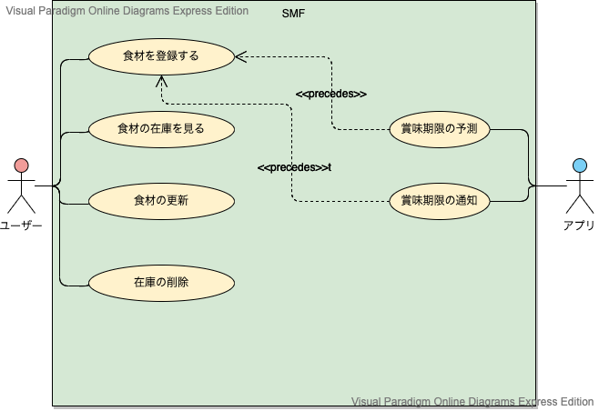

# SMF 実装

## 実装すること
SMFのユースケースは以下である.  
以下のユースケースの2.1 ユーザー用ユースケースを実装する.  
2.2 アプリ用ユースケースは未実装
### 1. ユースケース図

### 2. ユースケース一覧
#### 2.1 ユーザー用ユースケース
1. [食材を登録する](../usecase/usecase_register.md)
2. [食材の在庫を見る](../usecase/usecase_stock.md)
3. [食材の更新](../usecase/usecase_update.md)
4. [在庫の削除](../usecase/usecase_delete.md)

#### 2.2 アプリ用ユースケース
1. [賞味期限を予測する](../usecase/usecase_predict.md)
2. [賞味期限の通知](../usecase/usecase_notification.md)  
  
## 使用方法  
### 起動  
ポート番号:2289  
localhost:2289 で使用できる、スタンドアロン方式のアプリである。  
### MySQLのDB設定方法  
ユーザ名：SMF  
パスワード：tokuronI  
### 操作説明  
画面表示の通りに進めていくことができる。冷蔵庫の在庫を管理できる。詳しくはユースケースの2.1参照。

