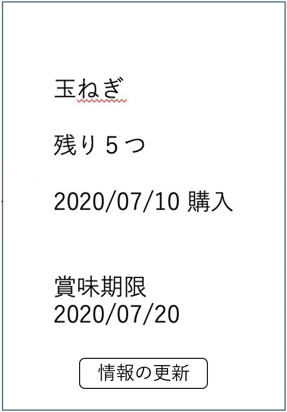

# ユースケース: 食材の情報を更新する

## 概要
ユーザが食材の情報を更新する.

## アクター
ユーザ

## 事前条件
システムが食材の詳細情報画面を表示している.

## 事後条件
食材の数量・賞味期限・購入日等のいずれかの修正, または食材の使用による数量変更の更新.

## トリガー
ユーザが, 食材の詳細情報画面で「情報の更新」ボタンを押す.

## 基本フロー
1. ユーザが, ある食材の詳細情報画面で「情報の更新」ボタンを押す.
2. システムは, その食材の情報の変更フォーム画面を表示する.
3. ユーザは, 変更したい情報を書き換え, 「確定」ボタンを押す.
4. システムは, 数量が負の値等のありえない値になっていないかチェックする.
5. チェックOKなら, システムは食材の情報を変更し, システムに保存, 食材の詳細情報画面を表示する.

## 代替フロー
### 代替フロー1
- 5a.1 基本フロー4において, 数量がありえない値になっていた場合, 数量エラーを表示し, 2に戻る.

## GUI紙芝居
### 詳細情報画面

### 変更フォーム画面

