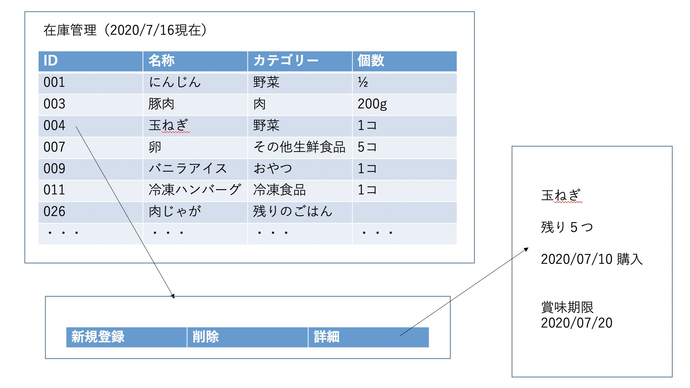

# 【ユースケース：冷蔵庫内の在庫確認】

## 概要
ユーザーが食材の情報（賞味期限，種類，在庫状況）を確認する．

## アクター
-ユーザー

## 事前条件
購入した食材が登録されていること．

## 事後条件
なし

## トリガー
ユーザーがシステムの使用を開始する．

## 基本フロー
1.システムは在庫確認画面を表示する．
2.ユーザーは食材の残量や詳細を確認する．

## 代替フロー
なし
## GUI紙芝居
### 在庫確認画面

