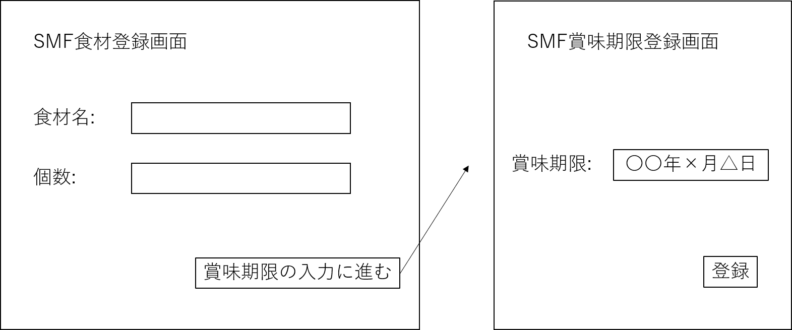

# 【ユースケース ： 食材を登録する】

## 概要
ユーザーが食材の情報(賞味期限，種類，在庫状況)を登録する．

## アクター
- ユーザー

## 事前条件
- なし

## 事後条件
- 食材が登録される

## トリガー
- ユーザーがシステムの使用を開始する

## 基本フロー
1. システムは食材登録画面を表示する．
2. ユーザーは，食材名,在庫状況(個数あるいはグラム数など)を登録する．
3. システムは登録された食材名で食材データを検索し，賞味期限を提案する．
4. ユーザーは食材の登録を完了する．

## 代替フロー
### 代替フロー1
- 3a.1 基本フロー3で食材データが存在しない場合，ユーザーに賞味期限の入力を求め，食材データに新たに情報を追加する．
- 3a.2 基本フロー3で提案された賞味期限がユーザーの望まないものであれば，変更することができる．

## GUI紙芝居
### 食材登録画面

