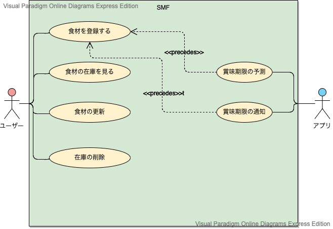

# SMF　ユースケースモデリング

SMFのユースケースモデリングを行う．

## 1. ユースケース図

## 2. ユースケース一覧
### 2.1 ユーザー用ユースケース
1. [食材を登録する](./usecase_register.md)
2. [食材の在庫を見る](./usecase_stock.md)
3. [食材の更新](./usecase_update.md)
4. [在庫の削除](./usecase_delete.md)

### 2.2 アプリ用ユースケース
1. [賞味期限を予測する](./usecase_predict.md)
2. [賞味期限の通知](./usecase_notification.md)
